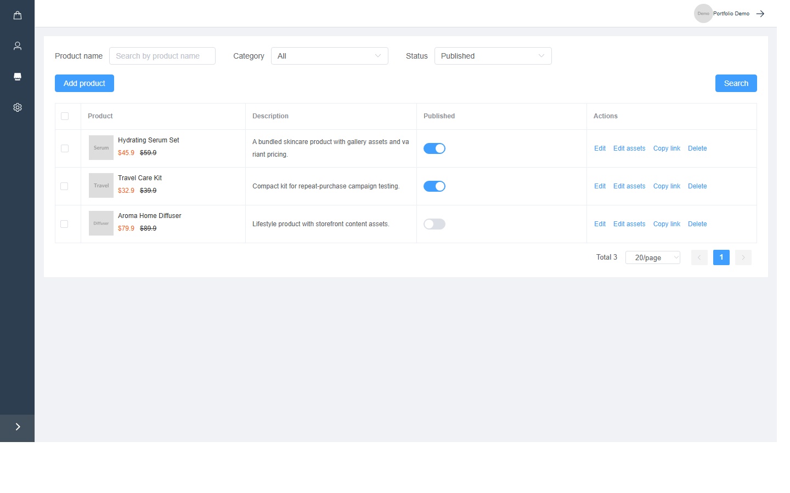
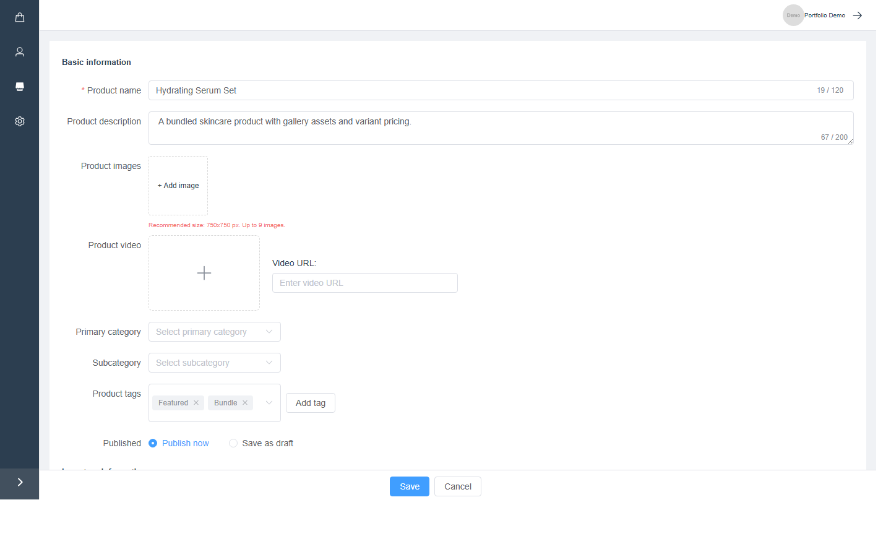
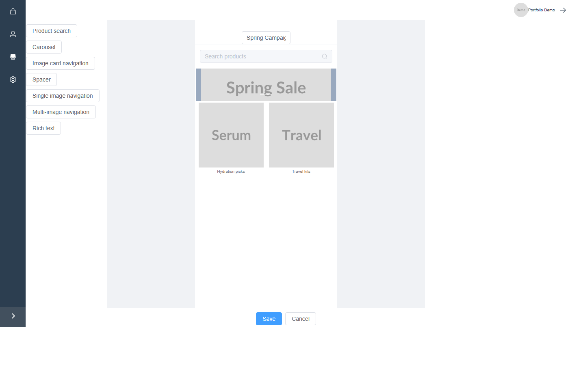

# E-commerce Admin Dashboard

A sanitized portfolio demo for an e-commerce operations backend. It shows the type of business system work involved in managing products, categories, customers, storefront content pages, media assets, rich text content, and system settings.

This project is based on previous business system experience. All sensitive data, production domains, credentials, and client-specific information have been removed or replaced with mock content.

## Features

- Product catalog management
- Product category management
- Customer list and customer permission controls
- Storefront landing page builder
- Media library picker for images and videos
- Rich text editing for product and content pages
- Basic store and upload settings
- Mock API mode for portfolio screenshots and local demos

## Tech Stack

- Vue 3
- Vite
- TypeScript
- Element Plus
- Vue Router
- Vuex
- Axios

## Getting Started

```bash
yarn install
yarn dev
```

The app uses mock data by default. To connect it to your own backend, copy `.env.example` to `.env` and set:

```bash
VITE_USE_MOCK_API=false
VITE_API_BASE_URL=https://your-api.example.com/admin/
```

## Portfolio Use

This repository is intended for public portfolio and case-study use. It is not a production-ready open-source product. The current goal is to demonstrate frontend implementation, admin workflow design, API integration patterns, and e-commerce domain experience.

## Screenshots

### Product Management List



### Product Editing Workflow



### Storefront Page Builder



## Project Status

Portfolio demo. Mock data is enabled by default.
